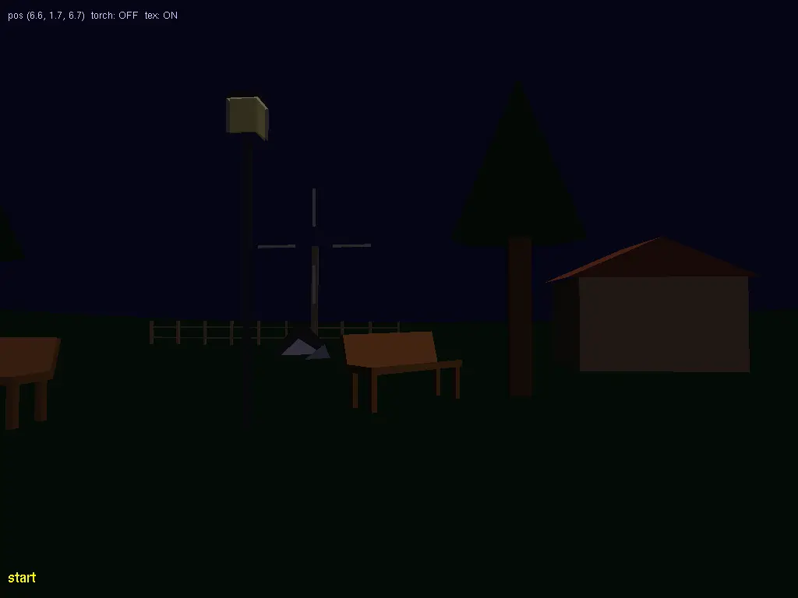
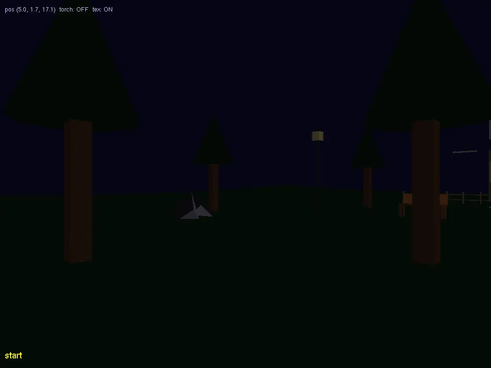
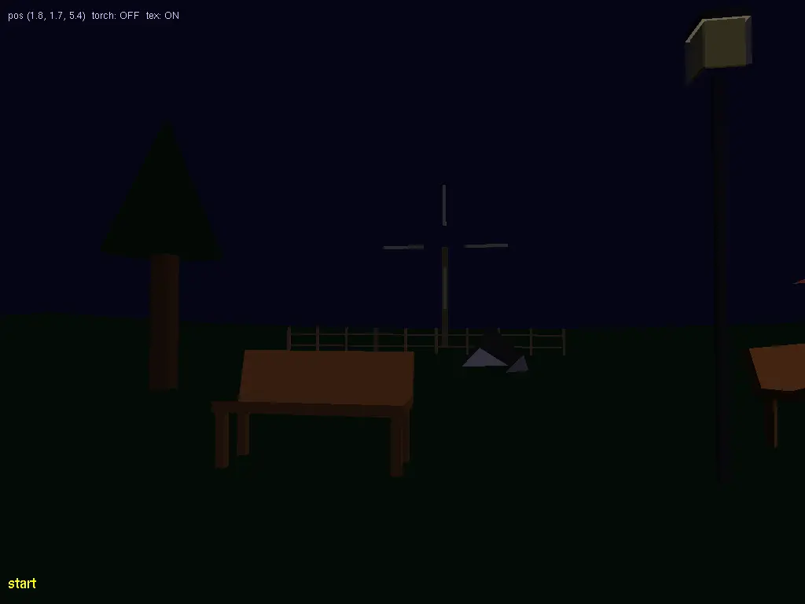

# MPC-MPG Projekt — Noční park

<!-- SCREENSHOTS_START -->
### Latest — v0.1.0




<!-- SCREENSHOTS_END -->

<!-- HISTORY_START -->
| Version | Scene 0 | Scene 1 | Scene 2 |
|---------|---------|---------|---------|
| [v0.1.0](screenshots/v0.1.0/) |  |  |  |
<!-- HISTORY_END -->

## Přehled

Semestrální projekt z předmětu MPC-MPG (2025/26).
Scéna: procházka nočním parkem z pohledu první osoby.
Jazyk: C++ s OpenGL/GLUT. Šablona: `xstude00.cpp`.

## Bodování (celkem 24 b)

| č. | Úkol | Body |
|----|------|------|
| 1  | Modelování — 5+ vlastních vertex-array objektů | 3 |
| 2  | Animace — rotující větrník | 1 |
| 3  | Osvětlení + korektní normály | 1 |
| 4  | Volný pohyb (myš + WASD/šipky) | 1 |
| 5  | Menu (≥5 položek, right-click) | 2 |
| 6  | Výpis textu (glutBitmapCharacter, 2D overlay) | 2 |
| 7  | Ruční svítilna (spotlight, klávesa R) | 2 |
| 10 | Stoupání/klesání (Page Up/Down) | 1 |
| 12 | Simulace kroků (camera bobbing) | 2 |
| 14 | Průhlednost (okno lucerny — alpha blending) | 1 |
| 16 | Texturování — 1× BMP/TGA + 1× procedurální | 2 |
| 17 | Bézierovy pláty (terén — kopce) | 2 |
| 11 | Hod předmětu (Space — kulička s gravitací) | 2 |
|    | **Celkem** | **24** |

Povinné (bez bodů): perspektivní projekce + backface culling.

## Objekty ve scéně (bod 1 — vertex arrays, žádné kvadriky ani glutSolid*)

1. **Strom** — kmen (6stěnný hranol) + koruna (jehlan/kužel z trojúhelníků)
2. **Lavička** — sedák + 4 nohy + opěradlo (quads)
3. **Lucerna** — sloup + těleso + průhledné okno (alpha)
4. **Kůlna** — obdélníkový dům se sedlovou střechou (trojúhelníkový štít)
5. **Balvan** — nepravidelný polyhedron ~10 trojúhelníků
6. **Plot** — opakovaný kvádrový sloupek ve smyčce
7. **Větrník** — středový sloup + 4 lopatky (animovány)

## Kamera a pohyb

Globální stav: `float camX, camY, camZ, yaw, pitch`.

```cpp
// pohyb
camX += sinf(yaw) * speed * dt;
camZ += cosf(yaw) * speed * dt;

// pohled (gluLookAt alternativa přes rotaci)
glRotatef(-pitch * RAD2DEG, 1,0,0);
glRotatef(-yaw   * RAD2DEG, 0,1,0);
glTranslatef(-camX, -camY, -camZ);
```

- Myš drag: delta X → yaw, delta Y → pitch (pitch clamp ±89°)
- A/D: strafe (pohyb kolmo na směr pohledu)
- Page Up/Down: camY ± 0.5, meze (-5, 30)

### Camera bobbing (bod 12)

```cpp
// při pohybu:
bobTimer += dt;
camBobOffset = sinf(bobTimer * 8.0f) * 0.15f;

// při zastavení — útlum:
camBobOffset *= 0.85f;  // exponenciální decay každý frame
```

## Osvětlení (bod 3)

- `GL_LIGHT0` — měsíc: `GL_POSITION = {0, 1, 0.3, 0}` (směrové, w=0), modrobílé, slabé ambient
- `GL_LIGHT1` — svítilna: `GL_POSITION` = pozice kamery, `GL_SPOT_DIRECTION` = směr pohledu
  - `GL_SPOT_CUTOFF = 15.0f`, `GL_SPOT_EXPONENT = 8.0f`
  - toggle klávesou R

Normály: každý objekt má ručně vypočtené normály (křížový součin nebo geometrické).
`glShadeModel(GL_SMOOTH)`.

## Textury (bod 16)

### Externí (grass.bmp)
```cpp
unsigned int texGrass;
setTexture("grass.bmp", &texGrass, true);  // imageLoad.h
// pak při kreslení terénu:
glBindTexture(GL_TEXTURE_2D, texGrass);
glTexParameteri(GL_TEXTURE_2D, GL_TEXTURE_WRAP_S, GL_REPEAT);
```

### Procedurální (šachovnice)
```cpp
unsigned int texChecker;
unsigned char checker[64*64*3];
for(int i=0;i<64;i++) for(int j=0;j<64;j++) {
    int idx = (i*64+j)*3;
    unsigned char c = ((i/8+j/8)%2) ? 200 : 80;
    checker[idx] = checker[idx+1] = checker[idx+2] = c;
}
glGenTextures(1, &texChecker);
glBindTexture(GL_TEXTURE_2D, texChecker);
glTexImage2D(GL_TEXTURE_2D, 0, GL_RGB, 64,64, 0, GL_RGB, GL_UNSIGNED_BYTE, checker);
gluBuild2DMipmaps(GL_TEXTURE_2D, GL_RGB, 64,64, GL_RGB, GL_UNSIGNED_BYTE, checker);
```

## Bézierovy pláty — terén (bod 17)

4×4 řídicí body = 1 bikubický plát. Použít 2–3 pláty vedle sebe.

```cpp
float terrain[4][4][3] = {
    {{-30,0,-30},{-10,3,-30},{10,2,-30},{30,0,-30}},
    {{-30,2,-10},{-10,8,-10},{10,6,-10},{30,1,-10}},
    {{-30,1, 10},{-10,5, 10},{10,7, 10},{30,2, 10}},
    {{-30,0, 30},{-10,2, 30},{10,3, 30},{30,0, 30}},
};

glMap2f(GL_MAP2_VERTEX_3,
    0,1, 3,4,    // u: 0..1, stride=3, order=4
    0,1, 12,4,   // v: 0..1, stride=12, order=4
    &terrain[0][0][0]);
glEnable(GL_MAP2_VERTEX_3);
glEnable(GL_AUTO_NORMAL);
glMapGrid2f(20, 0,1, 20, 0,1);
glEvalMesh2(GL_FILL, 0,20, 0,20);
```

**Pozor:** stride pro u = 3 (floaty na řádek), stride pro v = 12 (floaty na sloupec = 4*3).

## Menu (bod 5, right-click)

```cpp
int menu = glutCreateMenu(OnMenu);
glutAddMenuEntry("Reset kamery",     MENU_RESET);
glutAddMenuEntry("Animace ON/OFF",   MENU_ANIM);
glutAddMenuEntry("Textury ON/OFF",   MENU_TEX);
glutAddMenuEntry("Svetlo ON/OFF",    MENU_LIGHT);
glutAddMenuEntry("Svitilna ON/OFF",  MENU_TORCH);
glutAddMenuEntry("Konec",            MENU_EXIT);
glutAttachMenu(GLUT_RIGHT_BUTTON);
```

## Výpis textu (bod 6)

```cpp
void DrawHUD(const char* text) {
    int w = glutGet(GLUT_WINDOW_WIDTH);
    int h = glutGet(GLUT_WINDOW_HEIGHT);

    glDisable(GL_LIGHTING);
    glDisable(GL_TEXTURE_2D);

    glMatrixMode(GL_PROJECTION);
    glPushMatrix();
    glLoadIdentity();
    gluOrtho2D(0, w, 0, h);

    glMatrixMode(GL_MODELVIEW);
    glPushMatrix();
    glLoadIdentity();

    glColor3f(1,1,0);
    glRasterPos2i(10, 20);
    for(const char* c = text; *c; c++)
        glutBitmapCharacter(GLUT_BITMAP_HELVETICA_18, *c);

    glPopMatrix();
    glMatrixMode(GL_PROJECTION);
    glPopMatrix();
    glMatrixMode(GL_MODELVIEW);

    glEnable(GL_LIGHTING);
}
```

## Hod předmětu (bod 11)

```cpp
struct Projectile { float x,y,z, vx,vy,vz; bool active; };
Projectile projectiles[10];

// při Space:
void SpawnProjectile() {
    // najdi neaktivní slot
    float speed = 20.0f;
    p.x = camX; p.y = camY; p.z = camZ;
    p.vx = -sinf(yaw)*cosf(pitch)*speed;
    p.vy =  sinf(pitch)*speed;
    p.vz = -cosf(yaw)*cosf(pitch)*speed;
    p.active = true;
}

// v OnTimer nebo idle:
void UpdateProjectiles(float dt) {
    for(auto& p : projectiles) {
        if(!p.active) continue;
        p.vy -= 9.8f * dt;
        p.x += p.vx * dt;
        p.y += p.vy * dt;
        p.z += p.vz * dt;
        if(p.y < -5.0f) p.active = false;
    }
}
```

## Průhlednost (bod 14)

```cpp
// na konci OnDisplay, po neprůhledných objektech:
glEnable(GL_BLEND);
glBlendFunc(GL_SRC_ALPHA, GL_ONE_MINUS_SRC_ALPHA);
glDepthMask(GL_FALSE);
DrawLanternWindow();  // okno lucerny, alpha=0.4
glDepthMask(GL_TRUE);
glDisable(GL_BLEND);
```

## Kompilace — macOS / CLion

```cmake
cmake_minimum_required(VERSION 3.10)
project(mpg_projekt)
set(CMAKE_CXX_STANDARD 17)
add_definitions(-DGL_SILENCE_DEPRECATION)
add_executable(mpg_projekt projekt.cpp)
target_link_libraries(mpg_projekt "-framework OpenGL" "-framework GLUT")
```

## Ovládání

| Klávesa | Akce |
|---------|------|
| W / ↑ | pohyb vpřed |
| S / ↓ | pohyb vzad |
| A / ← | pohyb vlevo (strafe) |
| D / → | pohyb vpravo (strafe) |
| Myš tah | rozhlížení |
| R | toggle svítilna |
| Space | hod kuličky |
| Page Up | kamera nahoru |
| Page Down | kamera dolů |
| Right-click | menu |
| Esc | exit |

## Odevzdání

- `projekt.cpp` + `imageLoad.h` + `grass.bmp`
- krátké demo video na YouTube
- vše zabalené do .zip
- v .cpp hlavičce: jméno, xlogin, název, seznam úkolů+body, ovládání
