# MPC-MPG Project — Night Park

<!-- SCREENSHOTS_START -->
### Latest — v0.1.5


<!-- SCREENSHOTS_END -->

<!-- HISTORY_START -->
| Version | Scene 0 | Scene 1 | Scene 2 |
|---------|---------|---------|---------|
| [v0.1.5](screenshots/v0.1.5/) | 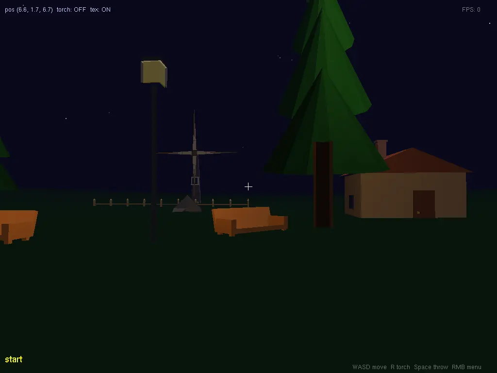 | 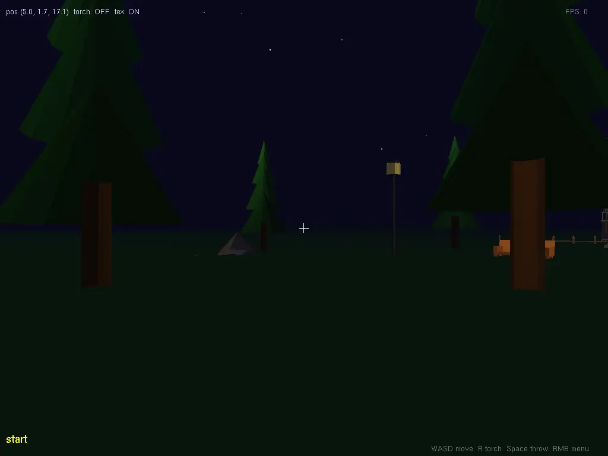 |  |
| [v0.1.4](screenshots/v0.1.4/) | 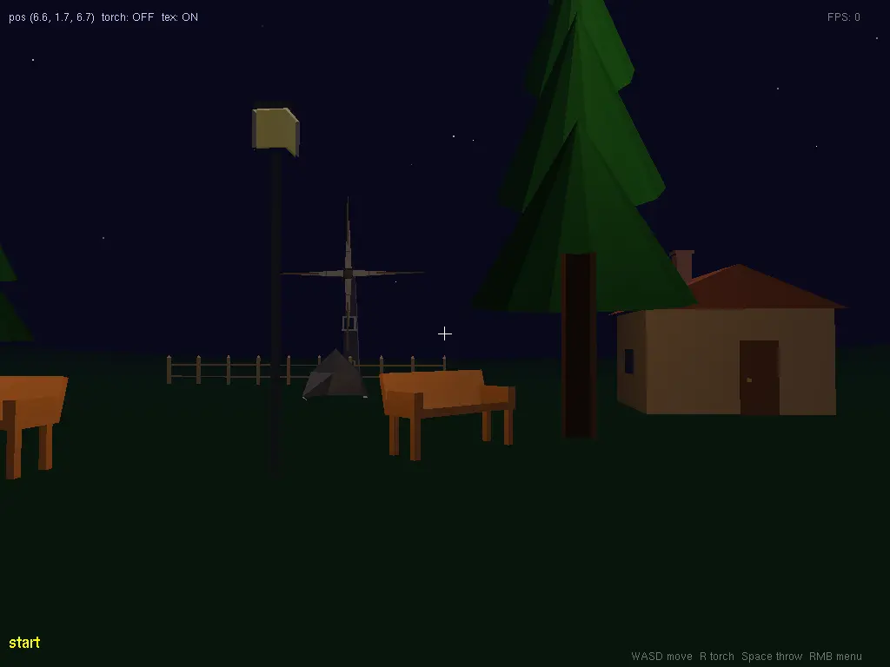 | 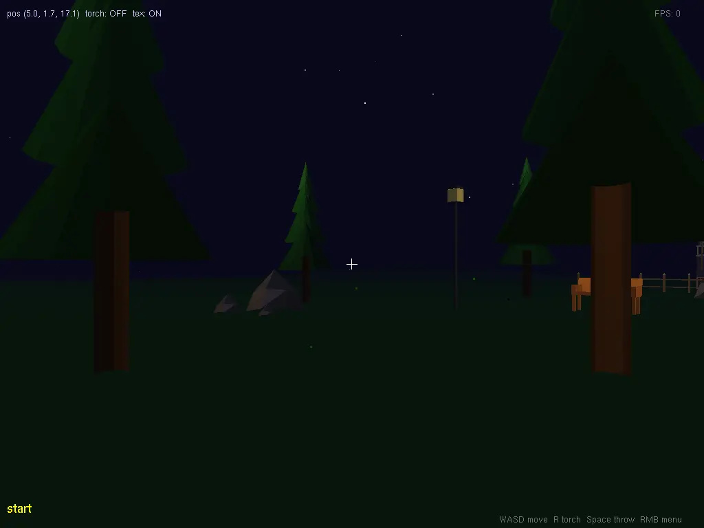 | 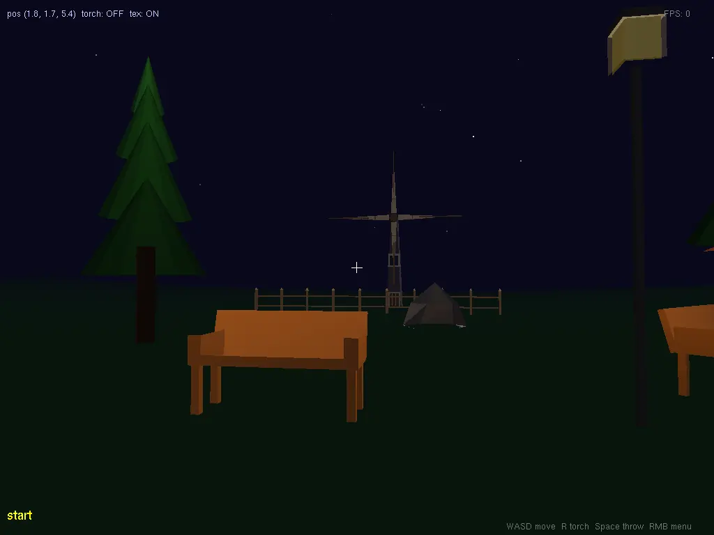 |
| [v0.1.3](screenshots/v0.1.3/) | 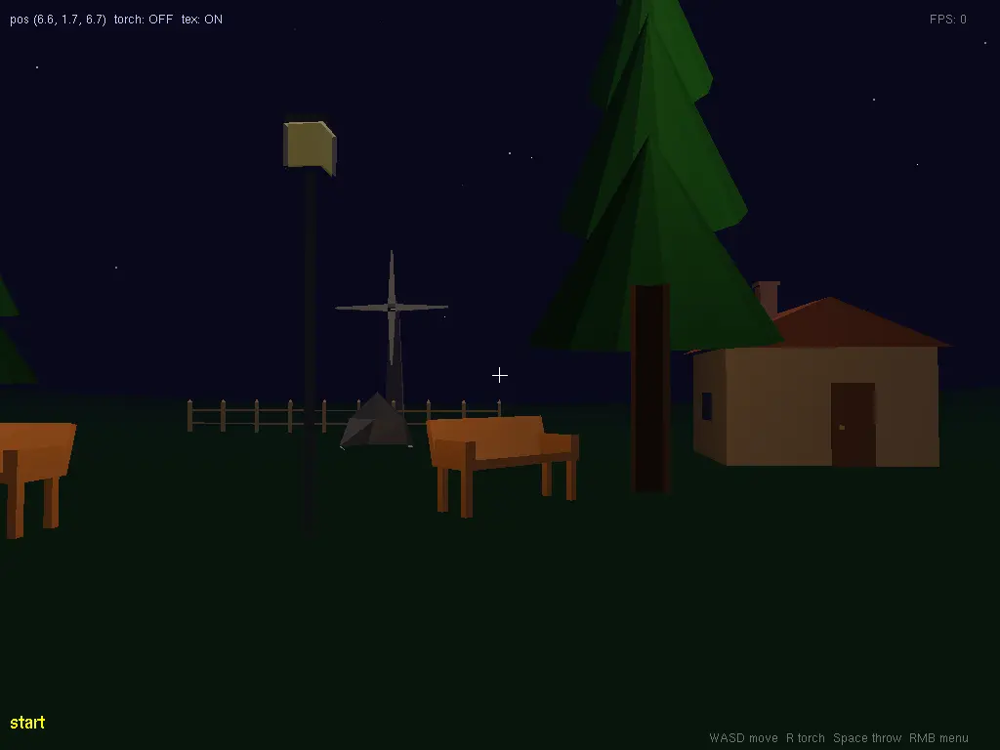 |  |  |
| [v0.1.2](screenshots/v0.1.2/) | 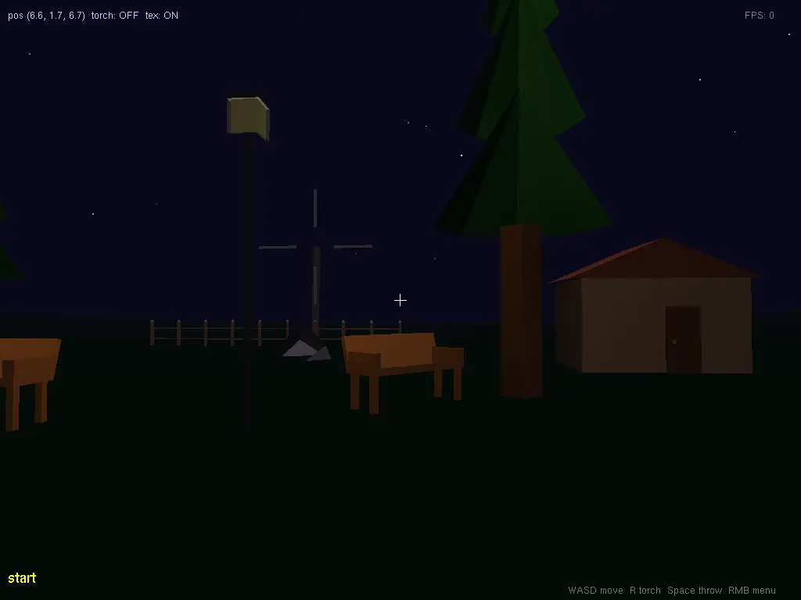 | 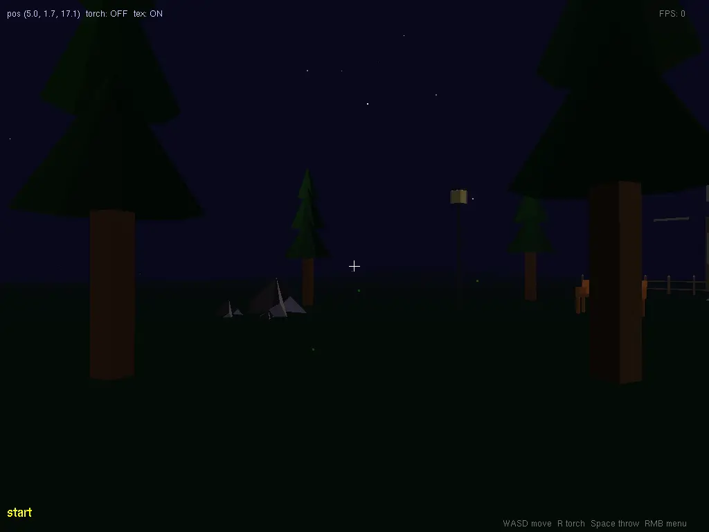 | 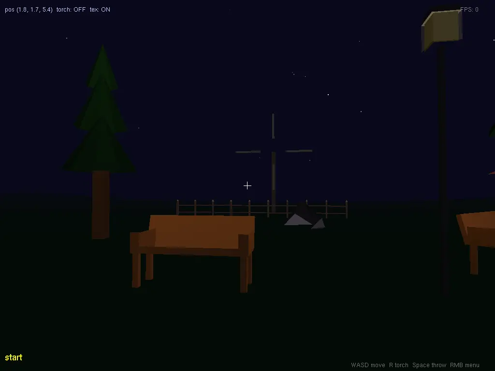 |
| [v0.1.1](screenshots/v0.1.1/) | 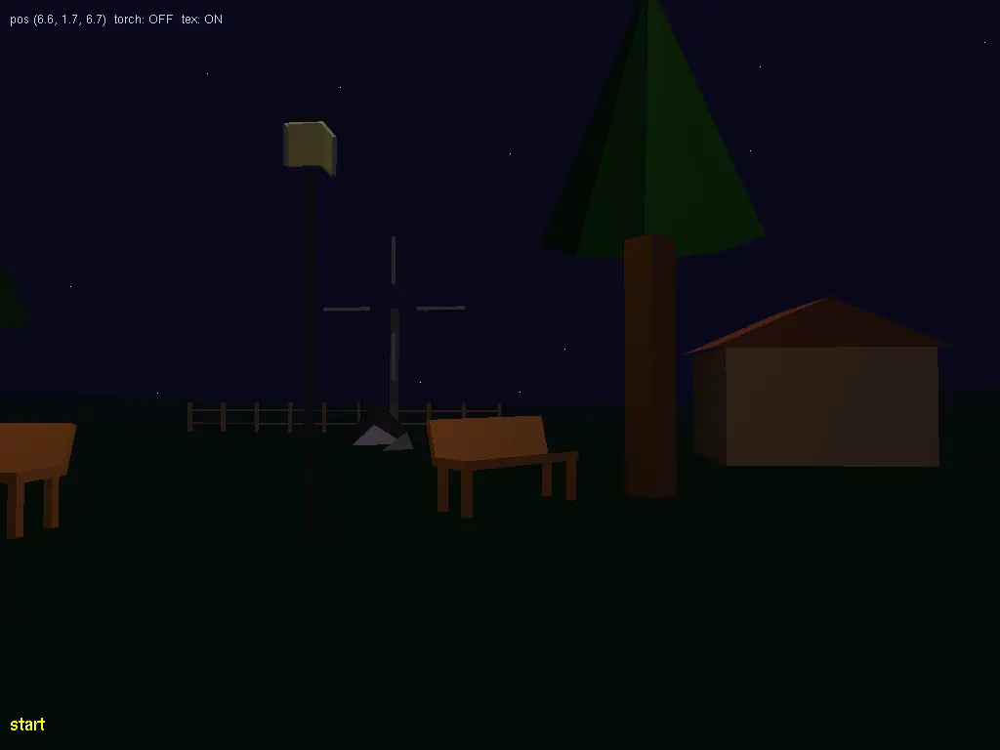 | 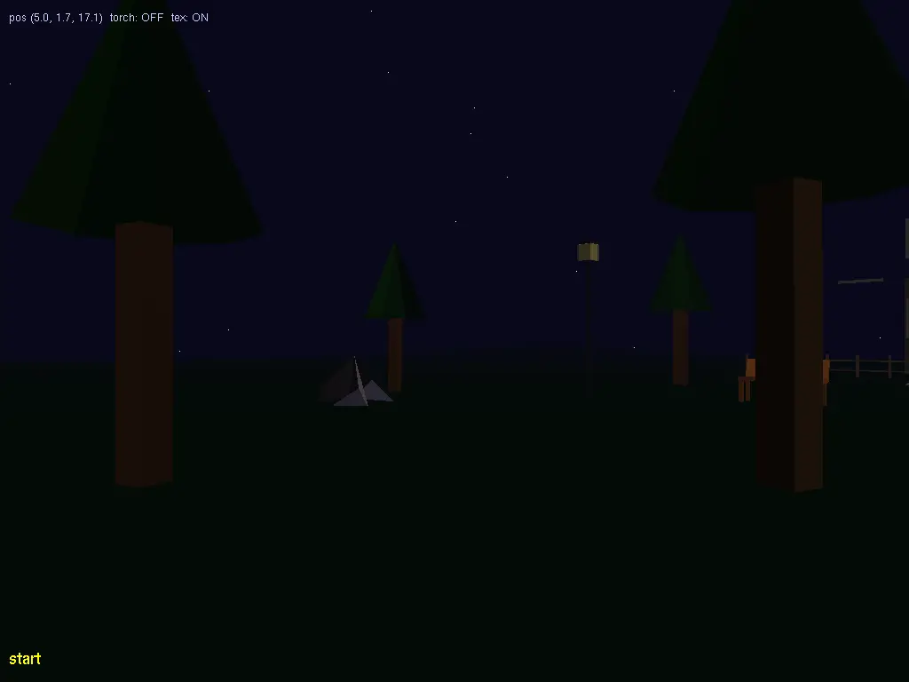 | 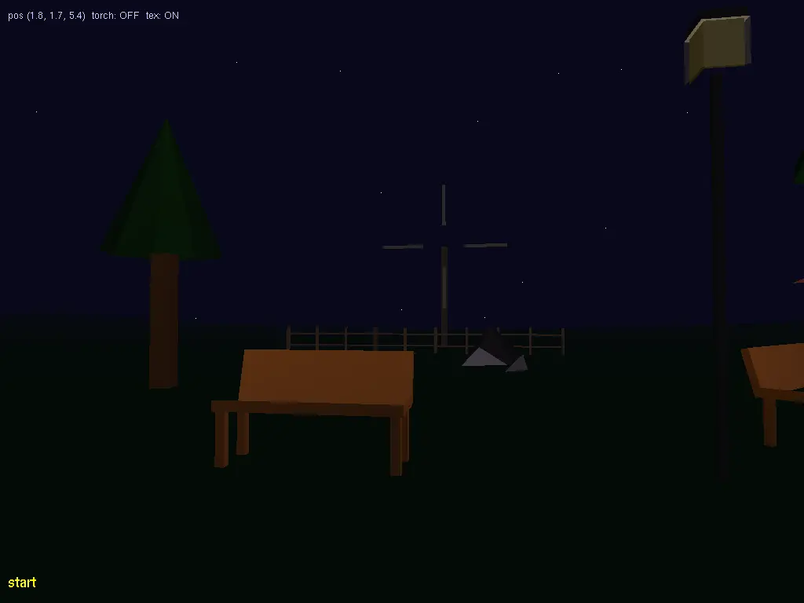 |
| [v0.1.0](screenshots/v0.1.0/) |  |  |  |
<!-- HISTORY_END -->

## Overview

Semester project for MPC-MPG (2025/26) at VUT FEKT.
Scene: a first-person walk through a night park.
Language: C++17 with OpenGL/GLUT (legacy fixed pipeline).

## Scoring (total 24 points)

| # | Task | Points |
|----|------|--------|
| 1  | Modelling — 5+ custom vertex-array objects | 3 |
| 2  | Animation — rotating windmill | 1 |
| 3  | Lighting + correct normals | 1 |
| 4  | Free movement (mouse + WASD/arrows) | 1 |
| 5  | Menu (≥5 items, right-click) | 2 |
| 6  | Text output (glutBitmapCharacter, 2D overlay) | 2 |
| 7  | Handheld torch (spotlight, key R) | 2 |
| 10 | Ascend/descend (Page Up/Down) | 1 |
| 12 | Step simulation (camera bobbing) | 2 |
| 14 | Transparency (lantern window — alpha blending) | 1 |
| 16 | Texturing — 1× BMP/TGA + 1× procedural | 2 |
| 17 | Bezier patches (terrain — rolling hills) | 2 |
| 11 | Throw object (Space — projectile with gravity) | 2 |
|    | **Total** | **24** |

Required (no points): perspective projection + backface culling.

## Scene objects (task 1 — vertex arrays, no quadrics or glutSolid*)

1. **Tree** — 8-sided trunk + four-layer spruce canopy + undergrowth disc
2. **Bench** — seat plank + 4 legs + tilted backrest + armrests
3. **Lantern** — pole + head box + transparent alpha window
4. **Shed** — box walls + gabled roof + door + side windows + chimney
5. **Boulder** — irregular polyhedron (24 triangles, two-tone material)
6. **Fence** — repeated posts with pyramid caps + two horizontal rails
7. **Windmill** — tapered octagonal tower + conical slate cap + disc hub + 4 structured blades with spine spars

## Camera and movement

State: `float camX, camZ, yaw, pitch, camFloorY, bobOffset`.

```cpp
// movement (WASD / arrow keys)
camX += -sinf(yaw) * kCamSpeed * dt;
camZ += -cosf(yaw) * kCamSpeed * dt;

// view transform
glRotatef(-pitch * RAD2DEG, 1, 0, 0);
glRotatef(-yaw   * RAD2DEG, 0, 1, 0);
glTranslatef(-camX, -(camFloorY + bobOffset), -camZ);
```

- Mouse drag: delta X → yaw, delta Y → pitch (clamped ±89°)
- A/D: strafe
- Page Up/Down: camFloorY ±0.5, clamped to (−5, 30)

### Camera bobbing (task 12)

```cpp
bobTimer  += dt;
bobOffset  = sinf(bobTimer * kBobFrequency) * kBobAmplitude;  // while moving
bobOffset *= 0.80f;                                            // decay when stopped
```

## Lighting (task 3)

- `GL_LIGHT0` — moon (directional, w=0): blue-white, `{0.3, 1.0, 0.2, 0}`
- `GL_LIGHT1` — torch (spotlight): follows camera, key R toggles; dual-sine flicker
  - `GL_SPOT_CUTOFF = 15°`, `GL_SPOT_EXPONENT = 8`
- `GL_LIGHT2/3` — lantern point lights: warm yellow, quadratic attenuation, slow pulse

All normals computed by hand (cross product or geometric). `glShadeModel(GL_SMOOTH)`.

## Textures (task 16)

- **grass.bmp** — 512×512 BMP, GL_REPEAT on Bezier terrain
- **Procedural checker** — 64×64 grayscale, applied to the stone path

## Bezier terrain (task 17)

4×4 bicubic patch. Outer edges rise to 2.5–3.0 units; centre strip near path stays flat at 0.

```cpp
static float cp[4][4][3] = {
    {{-40,3.0,-40},{-13,1.5,-40},{ 13,0.8,-40},{40,2.5,-40}},
    {{-40,1.5,-13},{-13,0.0,-13},{ 13,0.0,-13},{40,1.0,-13}},
    {{-40,1.0, 13},{-13,0.0, 13},{ 13,0.0, 13},{40,1.5, 13}},
    {{-40,2.5, 40},{-13,0.8, 40},{ 13,1.5, 40},{40,3.0, 40}},
};
glMap2f(GL_MAP2_VERTEX_3, 0,1, 3,4, 0,1, 12,4, &cp[0][0][0]);
glEnable(GL_AUTO_NORMAL);
glMapGrid2f(30, 0,1, 30, 0,1);
glEvalMesh2(GL_FILL, 0,30, 0,30);
```

## Transparency (task 14)

Draw order inside the transparent pass:
1. Alpha blend (`GL_SRC_ALPHA, GL_ONE_MINUS_SRC_ALPHA`) — windmill shadow, lantern windows
2. Additive (`GL_SRC_ALPHA, GL_ONE`) — lantern glow halos, windmill window glow

## Build

```bash
cmake -B build && cmake --build build
./build/mpg_projekt
```

Linux CI (Xvfb + Mesa): `LIBGL_ALWAYS_SOFTWARE=1 ./build/mpg_projekt`

## Controls

| Key | Action |
|-----|--------|
| W / S / A / D | move |
| Arrow keys | move (alternative) |
| Mouse drag | look around |
| R | toggle torch |
| Space | throw object |
| Page Up / Down | camera height |
| P | print camera state to stdout |
| Right-click | context menu |
| Esc | exit |

## Submission

- `xszucm00.cpp` + `scene.h` + `imageLoad.h` + `assets/textures/grass.bmp`
- Short demo video
- Packed as `.zip`
- File header: name, xlogin, project name, implemented tasks + points, controls
